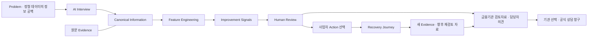

# 동행금융AI

동행금융AI는 소상공인의 비정형 사업 정보를 AI 인터뷰로 수집하고, 이를 근거 추적 가능한 금융 Feature로 변환하여 기존 금융정보의 공백을 보완하는 웹서비스입니다.

[금융기관 검토자료 만들기](https://donghaeng-finance-review-jy5k5cvnjq-du.a.run.app/demo/admin) · [사례 체험](https://donghaeng-finance-review-jy5k5cvnjq-du.a.run.app/judge-demo) · [서비스 소개](https://donghaeng-finance-review-jy5k5cvnjq-du.a.run.app/about) · [금융기관 검토실 복원·검증](docs/INSTITUTION_REVIEW_FINAL_2026-09-06.md)



심사자는 `/judge-demo`에서 직접 합성 답변 3개를 전송합니다. 기존 `InterviewService`가 원문과 Canonical revision을 저장하고 `improvementFeatures`를 생성합니다. `Feature Explorer`에서 산식·기간·누락 정책·선택 revision·원문까지 확인한 뒤, 확인한 범위를 `INCOMPLETE FINAL`로 보존하고 개선 Action을 선택합니다. 미션의 기록을 저장해야 `NEW EVIDENCE`가 생기며 FINAL은 바뀌지 않습니다. 결과가 저장되면 미션을 끝내지 않아도 금융기관 상담 준비서를 만들 수 있습니다. 기존 상담 초안 API로 기관과 준비자료를 저장하며, 원문 근거와 실행 기록은 서버의 `/api/interviews/:id/consultation-package`에서 읽어 인쇄/PDF 또는 JSON으로 받습니다. 기관에 자동 전송하거나 상담을 접수하는 기능은 아닙니다.

예시 입력 **“최근 3개월 평균 매출은 2300만원입니다.”**는 서버에서 `monthly_average_sales = 23,000,000 KRW` → `fin_sales_avg_3m = 23,000,000`으로 연결됩니다. 3개 합성 답변 시나리오는 100개 중 **13개 COMPUTED, 87개 MISSING**입니다. 신용정보·거래 내역을 수집한 것처럼 채우지 않으며, Signal의 원시값을 신용점수나 성공 확률로 환산하지 않습니다.

| 화면 | 확인할 내용 |
| --- | --- |
| `/` · `/about` | 정보 공백, 서비스 목적, 사업자·운영자 Flow, AI/서버/사람 역할 |
| `/judge-demo` | 실제 메시지 API·SSE·LIVE → Canonical/Evidence → 7개 그룹 Feature Explorer → Why → FINAL |
| `/borrower` · `/borrower/interviews/:id` | 기존 실제 음성·텍스트 인터뷰와 서버 데이터 생성 현황 |
| `/recovery/:id` | FINAL 이후 자발적 Action 선택, 3개 미션, append-only 자기보고 Evidence |
| `/review` · `/review/:id` | Evidence/Feature Coverage, Missingness, Signal, Action, 추가 확인 필요·검토 완료 |
| `/demo/admin` | 복원한 금융기관 검토실. 기존 94개 변수 사례의 사업 현황·평가 산식·원문·목표·6개월 수행자료·담당자 의견과 최종 검토서 |
| `/demo/admin?interview=:id` | 직접 진행한 인터뷰의 FINAL·100개 변수·원문·실행 기록·담당자 검토 의견을 하나의 자료로 확인·저장·내보내기 |
| `/consultation/:id` | 결과·원문 근거·100개 변수·계획·실행 기록을 묶은 상담 준비서, 기관 선택, 저장, 인쇄/PDF·JSON, 공식 상담 안내 |

기존 공유 주소 `/modeling?case=case_operating_drop&review=final`도 검토서로 바로 연결됩니다. 금융기관 검토자료는 **검토 요약 → 변수·근거 → 계획·기록 → 담당자 의견 → 자료 내보내기**의 5단계로 구성합니다. 사례 검토와 직접 진행한 인터뷰에 같은 작업 화면을 사용하고, 현재 자료와 내려받기 버튼을 옆에 고정합니다. 단계를 옮겨도 작성 중인 내용은 유지되며 `section=evidence`처럼 확인할 단계의 주소를 공유할 수 있습니다. 상담 준비 주소 `/consultation/:id`는 같은 화면의 내보내기 단계에서 시작합니다. [화면 통합·검증 기록](docs/INSTITUTION_REVIEW_WORKSPACE_2026-09-06.md)

최초·후속 자료의 분모와 누락 상태를 함께 표시하며, 기존 브라우저에 저장한 검토 의견을 그대로 사용합니다. 직접 진행한 인터뷰는 서버의 상담 패키지와 append-only 담당자 검토 API를 재사용합니다. 두 자료의 94개/100개 변수 계약은 구분합니다.

**Competition Demo / Synthetic Data.** 브라우저별로 체험 기록을 보관합니다. 실제 고객정보를 입력하지 않습니다. 본 서비스는 대출 승인·거절, 신용등급, 승인·부도 확률을 생성하지 않습니다. 학습된 신용모델·금융기관 데이터 연동·자동 신용 재평가·증빙 파일 진위 확인은 구현 범위에 포함되지 않습니다. 음성·외부 AI 처리 동의는 직접 선택합니다.

[이전 기능 통합·배포 기록 (2026-09-06)](docs/RELEASE_2026-09-06.md)

[2026-09-05 경쟁력 개선·제출 실행 계획](docs/WINNING_PLAN_2026-09-05.md) · [이번 개선 검증 기록](docs/SERVICE_IMPROVEMENTS_2026-09-05.md)

[공개 화면 완성도 개선](docs/SERVICE_POLISH_2026-09-05.md) · [10개 사례의 모델링 산출 증적](docs/MODELING_EVIDENCE_2026-09-05.md)

[기획안 10장에 맞춘 목표·수행기록·재평가·검토 요약 개선](docs/PLAN_ALIGNMENT_2026-09-05.md)

기존 `/modeling`의 Python 규칙 시제품은 별도 합성 거래자료와 94개 Vector를 사용하는 보조 실험입니다. 실제 인터뷰의 `feature_schema_v2` 100개 사전과 계약을 혼합하지 않습니다.

> 이 앱은 대출 승인·거절, 공식·추정 신용등급, 연체·승인 확률을 만들지 않습니다. 모델링 화면은 고정 규칙 시제품과 합성 mock 10개를 설명하며 예측력이 검증된 학습모델이 아닙니다. 기존 A~E 표시는 별도의 `INTERVIEW_DATA_QUALITY_GRADE_DEV_V1`으로 인터뷰 정보의 충족도와 추적 가능성만 뜻합니다.

## GCP 서비스

[심사용 공개 웹사이트](https://donghaeng-finance-review-jy5k5cvnjq-du.a.run.app/) — 첫 화면의 **사례 체험**에서 발화→Canonical→Evidence→Feature→Signal→계획 선택을 확인합니다. **기관 검토자료**에서 기존 금융기관 검토실을 바로 열고, **결과·상담 준비**에서 자신의 인터뷰 기록으로 검토자료를 만들 수 있습니다. **서비스 소개**는 목적과 사용자/운영자 과정을 설명합니다. 심사용 별도 DB·방문자별 격리·사용량 제한을 적용했고 실제 운영 자료와 합치지 않습니다.

[소유자 전용 실제 서비스](https://donghaeng-finance-ai-jy5k5cvnjq-du.a.run.app/) — 허용된 본인 Google 계정과 IAP가 필요합니다. 공개 심사 서비스와 VM·DB·서비스 계정을 분리합니다.

배포·복구·운영 제한은 [GCP 실제 서비스](docs/GCP_LIVE_SERVICE.md), 이번 수정과 검증 증적은 [서비스 점검 결과](docs/SERVICE_AUDIT_2026-09-04.md)를 참조하세요. 이전 공개 체험용 Dockerfile/배포 스크립트는 이 서비스에 사용하지 않습니다.

공모전 목적·공식 양식·실제 검증 절차·미충족 제출 요건은 [2026 금융 AI Challenge 점검](docs/FINANCE_AI_CHALLENGE_2026.md)에 정리했습니다. 제출 URL은 위 공개 심사용 주소를 사용하고, 소유자 전용 URL과 혼동하지 않습니다.

완료/불완전 종료 화면에서 원문 근거와 상태를 담은 상담 메모(TXT)를 내려받거나 브라우저에서 인쇄/PDF 저장을 요청할 수 있습니다. 거절·모름은 추가 확인 항목과 분리하고, 금융기관으로 자동 전송하지 않습니다.

## 기존 기능과 보조 실험

- `/modeling`은 심사자가 설명 없이 전체 모델링 흐름을 검토하는 화면입니다. 7개 출처 묶음, 조건부 질문 6개, 인터뷰 Feature 30개, 전체 94개 검색·필터, 결합 Feature 16개, 현재 상황/개선가능성 각 5개 규칙, 원문→변수→구간→점수 lineage, CB 대조, 업종 benchmark의 `CONTEXT_ONLY` 경계와 동일 Feature 재평가를 제공합니다.
- `/modeling?tab=impact`는 10개 사례 각각 정형 48개 변수를 고정한 전후 결과, 10개 평가항목 배점·분모, 94개 변수에서 평가 근거까지의 경로를 제공합니다. `/about`은 목적·전체 과정·사용자/운영자 Flow·현재 범위를 정리한 서비스 소개입니다.
- `/api/demo/modeling`과 `/api/demo/modeling/:caseId`는 빌드 시 Python `modeling/build.py`·`scorecard.py`를 실행해 만든 `modeling_web_v1` 산출물을 제공합니다. 브라우저가 점수나 lineage를 역추론하지 않습니다. 10개 사례의 Python/Web parity, 전후 산식·분모와 artifact checksum을 테스트합니다.

- 공개 첫 화면은 **사업 정보 수집과 근거 추적 가능한 Feature 생성**을 중심으로 3분 데모·서비스 소개를 안내합니다. 기존 모델링 사례 비교는 보조 실험 링크에서 확인합니다.
- `/interviews`의 **상담 대장**에서 권한이 있는 기록을 상태·이름으로 찾아 이어봅니다. 공개 방문자는 자신의 브라우저에 속한 기록을 확인합니다. `/demo`, `/demo/borrower`는 실제 인터뷰 화면으로 리다이렉트하며, `/demo/admin`은 복원한 금융기관 검토자료 페이지입니다.
- 실제 완료 화면은 사업 정보·답변 근거·미확인 항목·개선 후보를 보여 줍니다. 관리자 평가 상세의 **개선안·상담 초안**에서는 담당자·점검 시점·확인 자료·검토 기관을 서버에 명시적으로 저장하고 다시 불러옵니다. 동시 수정은 버전 충돌로 보호하며, 초안 저장은 FINAL 원본 변경이나 금융기관 전송이 아닙니다.
- 보호된 개발 환경에서는 호칭·사업체명·업종을 입력하며, 공개 환경은 가상 사업자 프로필로 채팅·음성을 시작합니다. 동의는 직접 선택하며 사업 수치나 답변을 자동으로 넣지 않습니다.
- 질문은 확인된 정보·누락값·근거를 바탕으로 서버가 선택합니다. 질문·답변 이력을 기본으로 보여 주며, 사업 현황은 별도 탭에서 확인합니다. 등록된 시연은 최종 답변을 Python 모형에 연결해 사업·행동 점수를 산출합니다.
- `OPENAI_API_KEY`가 설정된 음성 인터뷰는 `gpt-realtime-2.1`·`marin`과 브라우저 WebRTC로 직접 연결해 스트리밍 음성 입출력, semantic VAD, 자연스러운 끼어들기와 실시간 자막을 제공합니다. 브라우저에는 장기 API 키가 아니라 인터뷰·사용자별 rate limit이 적용된 단기 자격증명만 전달합니다.
- Realtime 연결 오류는 재시도/권한 안내를 먼저 표시하고, 사용자가 선택한 경우에만 문장 단위 음성으로 전환합니다. 보조 STT/TTS는 실행 환경에 따라 로컬 모델 또는 서버에 설정된 OpenAI 경로를 사용합니다. 어느 경로에서도 임의 답변을 만들지 않습니다.
- 인터뷰 Claude 기본은 고정 버전 `claude-sonnet-5`입니다. 서버가 상태·의존성·민감정보 순서로 안전한 다음 질문 후보를 최대 3개만 만들고, Sonnet은 그 안에서 하나를 고른 뒤 짧은 반응을 붙입니다. 요청은 `selectedInfoCode/reaction/question` 3필드·요청별 192토큰으로 제한하고 8초를 넘기면 서버 1순위 질문으로 즉시 이어갑니다.
- Claude 사용 시 답변 원문을 먼저 저장하고, 별도 `CLOUD_AI_PROCESSING` 동의 후에만 짧은 대화 반응을 요청합니다. 정보 추출, 값, 근거, 상태전이와 평가는 Claude가 바꿀 수 없고 서버 결정론 결과만 적용됩니다. 음성 모드는 Claude를 기다리는 동안 캐시된 확인 멘트를 먼저 들려줘 침묵을 줄입니다.
- 기존 전체 인터뷰의 종료 확인 화면과 신규 분석 이후 Recovery 화면에서 사장님은 근거 기반 개선 후보 3개 또는 건너뛰기를 직접 선택합니다. 서버가 현재 snapshot으로 후보를 재검증한 뒤 비구속 append-only 기록으로만 저장하며 목표·평가·신용판단에는 사용하지 않습니다.
- 음성 화면은 말끝부터 다음 질문·음성 재생까지의 최근 지연을 원문 없이 계측합니다. 사장님에게는 간단한 연결 상태만 보이고, 접힌 진단에서 latest/p50/p95와 안전 대체 경로 사용 여부를 확인할 수 있습니다.
- PREVIEW 진행 상태는 SSE로 동기화하고, 완료 후에는 불변 FINAL snapshot만으로 데이터 품질 평가를 만듭니다.
- 기존 실시간 인터뷰의 `feature_schema_v2`는 사업·재무·채무/신용·운영·사장님 계획·외부 맥락·개선가능성 변수를 null-safe artifact로 제공합니다. 이는 모델링 브랜치의 94개 `modeling_web_v1`과 이름·목적이 다른 별도 계약이며 둘을 같은 Vector처럼 섞지 않습니다. 현재 신용점수/승인 판단에는 사용하지 않으며 `ENABLE_FEATURE_V2=false`로 비활성화할 수 있습니다. 자세한 정의는 [feature_schema_v2](docs/FEATURE_SCHEMA_V2.md)를 참고하세요.

## 로컬 실행

요구 환경은 Node.js 24 이상이며 모델링 산출물 재생성에는 Python 3.12와 `modeling/requirements.txt`가 필요합니다.

```powershell
cd C:\donghaeng_finance_ai
npm install
python -m pip install -r modeling/requirements.txt
npm run modeling:generate
Copy-Item .env.example .env.local
npm run dev
```

`npm run dev`는 Next.js, SSE, 오디오 WebSocket을 함께 실행하는 custom server입니다. `dev:next`는 음성 WebSocket을 제공하지 않습니다.

로컬 실행은 `http://127.0.0.1:3000`을 사용합니다. 첫 접속 시 로컬 작업공간 세션을 만들고, 실제 인터뷰는 빈 상태에서 시작합니다. 기본 DB 경로는 `data/donghaeng-ai.db`입니다.

### 실제 음성

바탕화면의 **동행금융AI 실서비스 실행** 아이콘을 한 번 클릭하면 웹 서비스와 보조 경로인 faster-whisper STT·Qwen3-TTS Sohee를 함께 준비하고 브라우저를 엽니다. OpenAI 키가 등록돼 있으면 음성 인터뷰가 `gpt-realtime-2.1` WebRTC를 우선 사용합니다. 연결 실패 시 재시도하거나 사용자가 보조 방식을 선택할 수 있습니다. 최초 로컬 실행은 정적인 질문 음성 캐시 생성에 몇 분이 걸릴 수 있으며 이후에는 누락분만 확인합니다.

통화형 Realtime 음성을 활성화하려면 한 번만 다음 명령을 실행합니다. 키는 소스나 `.env`가 아니라 현재 Windows 사용자 범위 DPAPI 암호문으로 저장되고, 원클릭 실행기의 child server 환경에서만 복호화됩니다.

```powershell
.\Configure-OpenAI-Key.cmd
```

```powershell
Setup-Local-Korean-STT.cmd
Start-Local-Korean-STT.cmd
Setup-Local-Korean-TTS.cmd
```

두 Setup 명령은 각 모델을 최초 설치할 때만 필요합니다. 설치가 끝나면 원클릭 실행기가 STT와 TTS를 모두 자동으로 시작·재사용하며, 개별 Start 명령은 엔진만 따로 점검할 때 사용합니다.

웹과 음성 엔진을 이미 실행한 상태에서 캐시만 다시 점검하려면 `npm run voice:prewarm -- --origin http://127.0.0.1:3000`을 사용합니다. 이 명령은 로컬 인증 세션과 `/api/voice/speech` 경로만 사용하며, 사용자 답변이나 동적 개인화 문장은 디스크에 저장하지 않습니다.

- STT: `http://127.0.0.1:8765/v1/audio/transcriptions`의 실제 local `large-v3-turbo` faster-whisper
- TTS: `http://127.0.0.1:8766`의 Qwen3-TTS Sohee
- Realtime: 브라우저 WebRTC → OpenAI `gpt-realtime-2.1` / `marin`; 완료 전사만 기존 message command로 저장

로컬 음성 서비스가 준비되지 않은 경우, 앱은 가짜 전사나 임의 답변을 만들지 않습니다.

### Claude 구조화 사용

`Configure-Claude-Key.cmd`로 키를 등록한 뒤 `Start-Donghaeng-AI-Claude.cmd`로 로컬 서버를 시작할 수 있습니다. 키는 브라우저·소스·`.env`에 넣지 않고 현재 Windows 사용자 범위의 DPAPI 저장소에서 child process 환경으로만 전달합니다. 채팅에 노출된 키는 제한 설정과 별개로 폐기·회전해야 합니다.

원클릭 기본은 **Sonnet 5** 고정 버전입니다. `--quality`는 기존 실행 바로가기와의 호환 별칭이고, 지연 비교가 꼭 필요할 때만 `--fast`로 Haiku 4.5를 명시합니다. Sonnet 요청은 출력 192토큰, 8초 대화 soft deadline을 적용하며 초과 시 같은 서버 검증을 통과한 1순위 질문으로 안전하게 이어갑니다. 음성 인터뷰는 이 호출과 동시에 캐시된 짧은 확인 멘트를 재생해 무응답 대기 시간을 줄입니다.

Claude는 짧은 대화 반응과 서버가 허용한 최대 3개 질문 후보 중 선택만 맡습니다. 음성 인식, 정보 추출, 후보 생성·필터링, 정보 상태 전이, 점수화, 근거 검증, 완료 판정과 평가는 서버의 결정론적 정책으로 고정합니다.

## 환경 변수

| 변수 | 기본값 | 의미 |
|---|---:|---|
| `DONGHAENG_HOST` | `127.0.0.1` | custom HTTP server bind host |
| `DONGHAENG_PORT` | `3000` | HTTP/WS port |
| `DONGHAENG_APP_ORIGIN` | `http://127.0.0.1:3000` | mutation·WebSocket Origin 허용값 |
| `DONGHAENG_DB_PATH` | `data/donghaeng-ai.db` | SQLite 경로 |
| `DONGHAENG_LOCAL_BOOTSTRAP` | `1` | 로컬 작업공간 bootstrap 허용 여부 |
| `DONGHAENG_LOCAL_PASSWORD` | 없음 | 필요할 때만 설정하는 로컬 로그인 비밀번호 |
| `DONGHAENG_ORCHESTRATOR_PROVIDER` | `deterministic` | `deterministic` 또는 `anthropic` |
| `ANTHROPIC_API_KEY` | 없음 | server-only Anthropic 자격증명 |
| `OPENAI_API_KEY` | 없음 | server-only Realtime 세션 발급 자격증명; 브라우저에는 단기 secret만 전달 |
| `DONGHAENG_ANTHROPIC_MODEL` | `claude-sonnet-5` | 승인된 인터뷰 기본; Haiku 4.5는 명시적 지연 비교에만 사용 |
| `DONGHAENG_ANTHROPIC_SOFT_DEADLINE_MS` | `8000` | 초과 시 검증된 서버 1순위 질문으로 이어가는 대화 상한; 음성 경로는 캐시된 확인 멘트를 병렬 재생 |
| `DONGHAENG_ANTHROPIC_MAX_TOKENS` | `2304` | strict tool 응답 출력 상한 |
| `DONGHAENG_STT_PROVIDER` | `disabled` | `openai-compatible`로 local STT 연결 |
| `DONGHAENG_STT_ENDPOINT` | 없음 | local STT endpoint |
| `DONGHAENG_STT_MODEL` | `large-v3-turbo` | local Whisper 모델 |

외부 공개 배포는 아직 승인된 IdP, MFA, 운영 session adapter, TLS termination, managed database가 없으므로 fail-closed됩니다. `npm run start`는 해당 운영 인증 구성이 없으면 port를 열기 전에 종료합니다.

## 검증

```powershell
npm test
npm run typecheck
npm run lint
npm run modeling:generate
npm run build
npm run test:e2e
npm run verify:demo
```

`verify:demo`는 서버를 띄우고 [시연 시나리오](docs/DEMO_SCENARIO.md)의 대본대로 인터뷰를 끝까지 진행한 뒤, 그 결과로 계산한 2축 점수를 기준 케이스와 대조합니다. `modeling/requirements.txt`를 설치한 Python이 필요하며 기본 경로는 `.venv/bin/python`입니다.

`test:e2e`는 production build에서 로컬 Claude/STT stub을 사용해 HTTP, SSE, WS, 동의, 11항목 수집, FINAL, 평가 목록까지 확인합니다. 실제 API 키나 외부 과금은 사용하지 않습니다.

## 문서

- [서비스 전체 체험형 UX 점검·개선 및 검증 기록](docs/SERVICE_EXPERIENCE_REVIEW.md)
- [실제 화면 순회 점검·개선 기록 (2026-09-04)](docs/UI_WALKTHROUGH_2026-09-04.md)

- [GCP 공개 체험 배포](docs/GCP_REVIEW_DEPLOYMENT.md)
- [시연 시나리오](docs/DEMO_SCENARIO.md)
- [AI 작업 방식](docs/AI_WORKFLOW.md)
- [HTTP 계약](contracts/openapi.json)
- [SSE·WS 계약](contracts/asyncapi.json)
- [아키텍처](docs/ARCHITECTURE.md)
- [실시간·음성 경계](docs/REALTIME_BOUNDARY.md)
- [운영 전 차단 조건](docs/PRODUCTION_GATES.md)

- [Feature 통합 및 공개 반영 기록](docs/FEATURE_INTEGRATION_2026-09-05.md)
